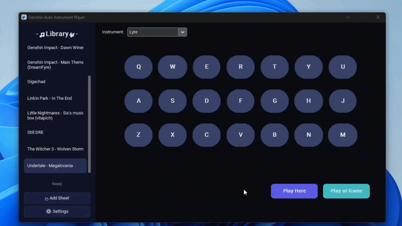

# 🎵 Genshin Auto Instrument Player

Play music automatically in **Genshin Impact** using sheet files!

<p align="center">
  
</p>

---

## ✨ Features

- 🪉 21-key Genshin Instrument interface  
- 🎵 Support for multiple instruments (Lyre, Zither, etc.)  
- 📂 Easy sheet file management  
- 🎮 Play in-game or locally  
- 📜 Supports multiple sheet formats  

---

## 📥 Installation

### Option 1: Executable (Easiest)

1. Download `GenshinAutoPlayer.exe` from the [**Releases**](https://github.com/MERT-CKR/Genshin-AutoLyrePlayer/releases/tag/Genshin_Auto_Lyre_Player) page  
2. Run as **Administrator**  
3. Done!

#### Why administrator privileges?

Because **Genshin Impact runs with administrator privileges**, an application without admin rights cannot interact with it.

---

### Option 2: Python (For Developers)

1. Install Python 3.8+  
2. Clone this repository  
3. Install dependencies:

```bash
pip install -r requirements.txt
```

4. Run:

```bash
python main.py
```

---

## 🎮 How to Use

1. **Select Instrument** – Choose from the dropdown  
2. **Add Sheet** – Click the "Add Sheet" button  
3. **Select Music** – Click on a song  
4. **Play** – Choose "Play Here" or "Play at Game"

### ⏯️ Play at Game

- Set the target window in **Settings**  
- Focus on Genshin Impact  
- Press **Play at Game**  
- Press `ESC` or `"` to stop

---

## 📝 Sheet Format

The application supports both:

- `notes` structure  
- `columns` structure  

It uses the same note system as:

👉 [Genshin Music Nightly](https://specy.github.io/genshinMusic/)

You can create music there and play it directly in this app or in-game.

---

## 🎵 Where to Find Ready-Made Sheet Music

- Discord Channel: [Sky & Genshin Music Nightly](https://discord.ggArsf65YYHq)  
- Search in Discord communities for sheets

---

## 📂 Supported Sheet File Extensions

- `.txt`  
- `.json`  
- `.genshinsheet`

---

## 📥 Adding Sheets

### `.genshinsheet`

This format is fully supported.  
Simply open the app and click the **Add Sheet** button.

### `.skysheet`

1. Upload it to [Genshin Music Nightly](https://specy.github.io/genshinMusic/)  
2. Download it in a supported format  
3. Open the app and click **Add Sheet**

---

## 📁 Managing Sheets

- Press `Win + R`, type `appdata` and go to `\GenshinAutoPlayer\sheets`
- The `sheets` folder contains all available music files  
- You can rename or remove them freely  
- If there are no sheets, simply add your own

---

## 📜 License

Apache License Version 2.0

---

## 🙏 Credits

- Made by **Mert Çakır**  
- Uses **CustomTkinter**, **Pygame**, **PyAutoGUI**

---


